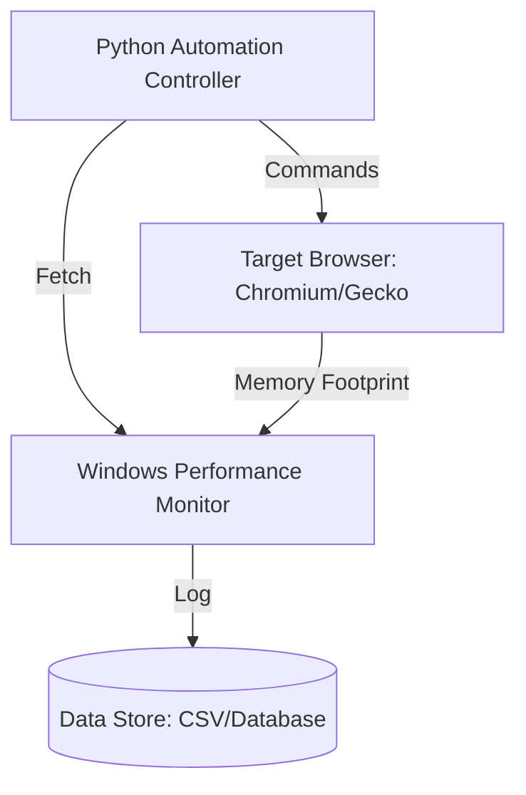
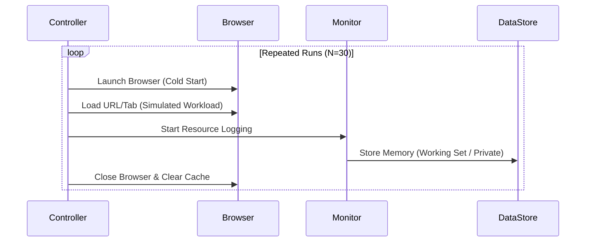

# Arsitektur Eksperimen dan Skema Data Pengujian

Dokumen ini mendefinisikan arsitektur sistem pengujian, alur kerja eksperimen, dan skema data untuk riset komparatif memori *browser* (Chromium vs. Gecko) sesuai dengan metodologi proposal penelitian.

## 1. Arsitektur Komponen Pengujian

Sistem pengujian menggunakan arsitektur otomatisasi untuk mengontrol siklus *browsing* dan mengumpulkan metrik memori secara sistematis tanpa intervensi manual selama pengujian.

## 2. Diagram Alur Eksperimen

Alur ini memastikan konsistensi data melalui proses pengujian berulang (N=30) guna meminimalisir deviasi metrik memori.

## 3. Skema Data (Database / CSV)

Struktur data untuk menyimpan metrik perbandingan memori dari hasil pengujian.

| Kolom | Tipe | Deskripsi |
|---|---|---|
| `run_id` | `INT` | Unique identifier for each run |
| `browser_name` | `VARCHAR` | Chromium atau Gecko |
| `process_name` | `VARCHAR` | Browser / Renderer / GPU process |
| `memory_working_set` | `BIGINT` | Working Set Memory (KB) |
| `memory_private_usage` | `BIGINT` | Private Working Set (KB) |
| `timestamp` | `TIMESTAMP` | Waktu perekaman |

## 4. Pemetaan ke Implementasi (Data Profiling)

- **Data Ingestion**: Metrik diambil menggunakan Windows Performance Monitor (PerfMon) dengan interval sampling 1000 ms untuk mendapatkan resolusi data yang akurat.
- **Preprocessing**: Data dibersihkan dari outlier menggunakan metode statistik, seperti Z-score atau IQR, untuk memastikan hanya data normal yang dianalisis.
- **Analysis**: Data dibandingkan menggunakan pengujian hipotesis (Uji T atau Uji Mann-Whitney) untuk menentukan perbedaan signifikan efisiensi memori antara engine Chromium dan Gecko.

## 5. Teori Operasional Memori

- **Chromium (Blink / V8)**
  - Menggunakan arsitektur process-per-tab.
  - Manajemen memori sangat bergantung pada Garbage Collection (GC) V8 yang agresif.
  - Mengandalkan fitur *Memory Saver* untuk melakukan tab discarding.

- **Gecko (Mozilla)**
  - Berfokus pada resource-sharing antar-tab.
  - Menggunakan mekanisme Tab Unloading yang dipicu secara otomatis saat kondisi memori fisik mencapai ambang batas.
